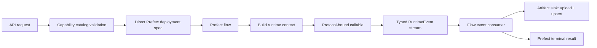

# Runtime Registration Contract

Status: accepted
Date: 2026-08-07

This contract separates capability registration, execution infrastructure, and
runtime results. `CORE_DESIGNS.md` is authoritative.

## One Module-Owned Capability Registration

Each algorithm-owning module exposes a `RuntimeRouter`. A paired trainer and
predictor are declared once:

```python
SC_RUNTIME_ROUTER = RuntimeRouter()


@SC_RUNTIME_ROUTER.algorithm(
    id="yolo-sc-v1",
    trainer_name="YOLO SC Defect Classifier",
    predictor_name="YOLO SC Defect Prediction",
    input_view=SC_PATCH_IMAGE_V1,
    model=SC_YOLO_MODEL_V1,
    algo_id="yolo-sc",
    algo_version="1",
)
class YoloScAlgorithm:
    train = staticmethod(yolo_sc_train)
    predict = staticmethod(yolo_sc_predictor)
    train_and_predict = staticmethod(run_sc_train_and_predict)
```

Registration arguments are code-owned capability metadata, not ML
hyperparameters or deployment configuration:

| Parameter        | Purpose                                                               |
| ---------------- | --------------------------------------------------------------------- |
| `id`             | Stable product catalog ID selected by API submissions.                |
| `trainer_name`   | Trainer display name.                                                 |
| `predictor_name` | Predictor display name.                                               |
| `input_view`     | Exact versioned dataset view contract consumed by the algorithm.      |
| `model`          | Trainer output and predictor input model contract.                    |
| `algo_id`        | Stable executable algorithm-family identity used in logs and audit.   |
| `algo_version`   | Version of algorithm behavior, separate from model artifact versions. |

The decorator must not accept operation, deployment, work-pool, owner,
missing-image policy, output contract, or code-version arguments.

The lower-level `trainer()`, `predictor()`, and `train_and_predict()` decorators
remain available for non-one-to-one pairing. They declare the same metadata and
callable identity without deployment routes.

## Protocol-Derived Operations

Runtime operation support is derived from three runtime-checkable Protocols:

```python
@runtime_checkable
class Trainable(Protocol):
    @staticmethod
    def train(ctx: TrainingRuntimeContext) -> RuntimeEventStream: ...


@runtime_checkable
class Predictable(Protocol):
    @staticmethod
    def predict(ctx: PredictionRuntimeContext) -> RuntimeEventStream: ...


@runtime_checkable
class TrainAndPredictable(Protocol):
    @staticmethod
    def train_and_predict(
        ctx: TrainAndPredictRuntimeContext,
    ) -> RuntimeEventStream: ...
```

`RuntimeRouter.algorithm()` requires `Trainable` and `Predictable`. Implementing
`TrainAndPredictable` makes the combined operation available. The decorator
performs this discovery once during import and caches the bound callables.
Runtime Protocol checks verify member presence; pyright verifies signatures.

`RuntimeCapabilityCatalog` aggregates module routers and remains the single
query surface. It validates duplicate IDs, registered views, trainer/predictor
pairing, and exact model contracts. It exposes operation-specific methods:

- `stream_train(trainer_id, context)`;
- `stream_predict(predictor_id, context)`;
- `stream_train_and_predict(trainer_id, context)`;
- `supports_train_and_predict(trainer_id)`.

There is no generic `invoke(operation, ...)`, operation enum, route map,
metadata-only duplicate catalog, YAML capability preset, or directory scan.

## Deployment And Work Pools

Prefect deployment is execution infrastructure and is declared independently
from algorithm registration. One repository-owned `PrefectDeploymentSpec`
contains the deployment name, flow name, entrypoint, work pool, optional work
queue and path.
Deployment seed, startup validation, and submission consume the same objects.

| Deployment                                | Flow                         | Work pool     | Work queue / priority        |
| ----------------------------------------- | ---------------------------- | ------------- | ---------------------------- |
| `train-job-deployment`                    | `training-train-job`         | `default-gpu` | default                      |
| `train-and-predict-deployment`            | `training-train-and-predict` | `default-gpu` | default                      |
| `predict-job-batch-deployment`            | `prediction-predict-job`     | `default-gpu` | `prediction-manual` / 1      |
| `predict-job-batch-automation-deployment` | `prediction-predict-job`     | `default-gpu` | `prediction-automation` / 10 |
| `collection-discovery-poll`               | `collection-discovery-poll`  | `default-cpu` | default                      |
| `drain-dataset`                           | `drain-dataset`              | `default-cpu` | default                      |

A deployment identifies a configured flow submission target. A work pool is
the execution resource queue to which that deployment is bound. CPU/GPU is
therefore expressed by the selected work pool, not by a capability
`resource_profile` field and not by string concatenation during seed.

Prefect uses lower numeric work-queue priorities first. Manually submitted and
manually retried prediction work uses the manual queue; incremental Collection
automation uses the automation queue. Queue priority does not preempt a running
flow run.

All current deployments are repository-owned. There is no `owner` field or
external deployment branch. A future external runtime should be integrated by
an explicit adapter task or service client when it exists.

## Typed Runtime Events

Every registered callable is an async generator returning a closed event union.
The project supports Python 3.11, so the alias uses `TypeAlias`:

```python
RuntimeEvent: TypeAlias = (
    ArtifactOutput
    | MetricsReported
    | ProgressReported
    | RuntimeIssueReported
    | OperationCompleted
)
```

Event responsibilities:

| Event                  | Meaning                                                           |
| ---------------------- | ----------------------------------------------------------------- |
| `ArtifactOutput`       | Hands one file/URI payload and its metadata to the artifact sink. |
| `MetricsReported`      | Reports metrics for the flow result and product events.           |
| `ProgressReported`     | Reports bounded progress without defining algorithm topology.     |
| `RuntimeIssueReported` | Reports a recoverable or per-item problem; execution continues.   |
| `OperationCompleted`   | The one terminal event carrying the operation summary.            |

The generic flow host exhaustively matches the union with `assert_never`,
rejects events after completion, requires exactly one terminal event, and
assembles a transport-safe Prefect result. This event type is the output
boundary; no string `output_contract` is declared or revalidated.

Algorithms own dataset construction, materialization, batch/chunk policy,
artifact payload/metadata construction, prediction persistence, and progress
cadence. `ArtifactOutput` deliberately combines the payload and its metadata:
the event sink uploads a local file with `put_file` (or accepts an already stored
URI), then idempotently upserts the platform `ArtifactRef`. A stable artifact ID
and object name make a retry overwrite/upsert the same logical output.

The callable yields a local checkpoint path while its workspace is still open.
Direct async iteration means the consumer finishes the upload before requesting
the next event, after which the callable may clean the workspace. Large
checkpoint bytes never enter the event or Prefect terminal result.

Local implementations are grouped by algorithm, not operation. The current
Ultralytics module contains both YOLO train and predict; the former ResNet module
has been removed. A generic callable-parameterized train/predict runner or
separate `trainers.py` / `predictors.py` implementation modules would erase
algorithm-owned dataset and error semantics and are not used.

Recoverable failures are emitted as `RuntimeIssueReported`. A function author
terminates an expected fatal operation by raising `RuntimeExecutionError` with
a stable code and details. Unknown exceptions propagate unchanged and fail the
Prefect run. A generic Rust-style `Ok`/`Err` chain is not used because Python
cannot enforce `must_use`; the closed event union plus exceptions provides the
exhaustive boundary without nested result wrapping.

## Dispatch



Flow parameters contain only transport-safe job/source/model/capability IDs and
request options. They do not repeat catalog ID, view/model contract,
algorithm/code version, owner, resource profile, missing-image policy, or output
contract. The flow entrypoint determines the operation and the selected
trainer/predictor ID resolves the callable.

## Model Artifact Lifecycle

Every model artifact is attached to one persisted training job. Manual upload
validates that the job belongs to the active organization and that the caller
created it before reading or storing the file. The artifact records the exact
`model_contract`, `model_schema_version`, and trainer ID from that job's
registered capability; caller-supplied contract values may only confirm, not
override, those values. If metadata persistence fails after object upload, the
new object is deleted as compensation.

Deleting a model removes only that artifact row and object. Metrics, logs, and
other model artifacts from the same training job remain intact so job history
and sibling model versions are not destroyed.

## SC Failure Semantics

Missing-image behavior belongs to the SC implementations:

- workflow preflight validates annotation labels only, outside the HTTP request path,
  and leaves actual image resolution to runtime;
- the YOLO trainer skips materialization failures and unreadable image pairs;
- after filtering, training fails with `RuntimeExecutionError` unless at least
  two effective labels remain;
- predictors write per-sample failures and continue the batch, then report an
  aggregate runtime issue when failures occurred.

Readiness reports retain usable, unusable, and skipped counts but do not expose
or receive a registration-level policy.

## Import And Process Boundaries

Registration modules must remain import-safe. They may import lightweight
callables and metadata but must not import Torch/CUDA, load model weights, or
perform I/O during import. Optional `libs/ml` implementations remain lazy imports inside
the selected callable.

Production execution may later move to `services/*`. External services consume
transport contracts and data-plane manifests; they do not import API services,
repositories, ORM models, injector containers, or Python runtime event classes.
