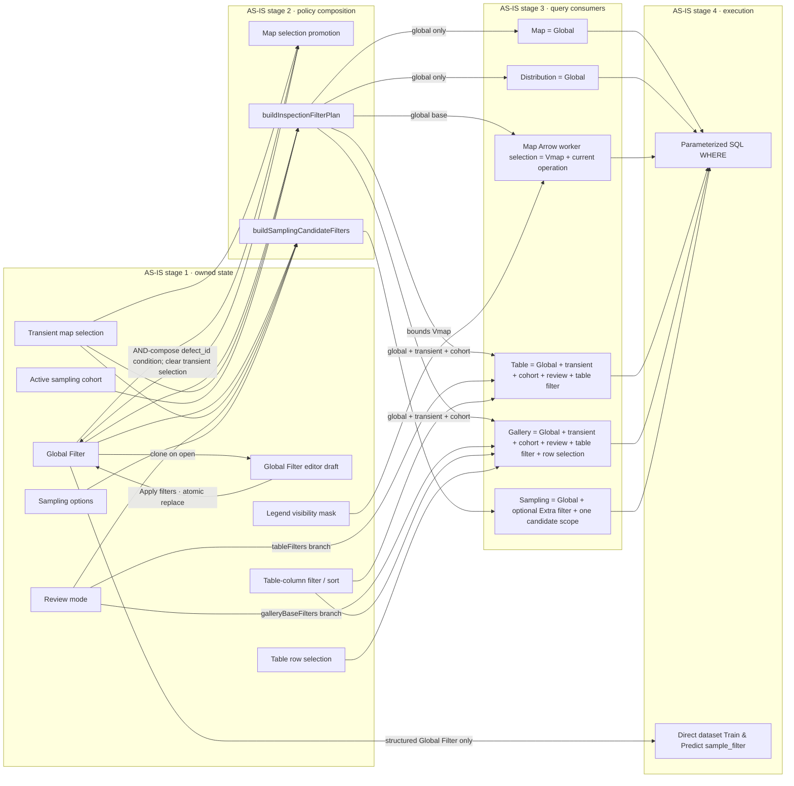
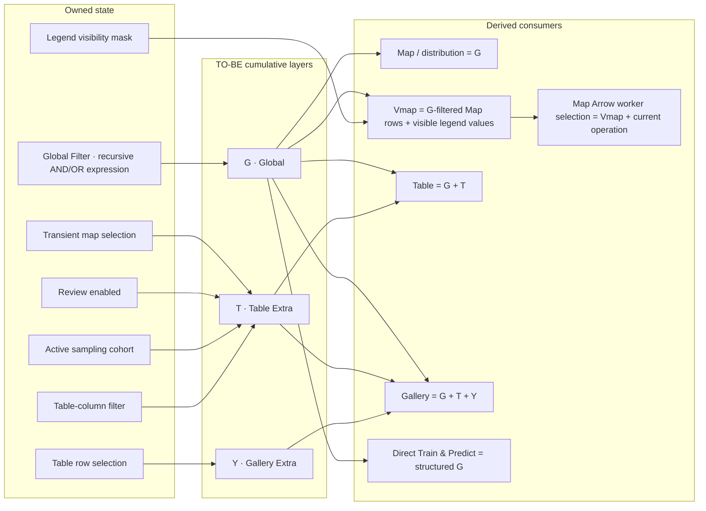
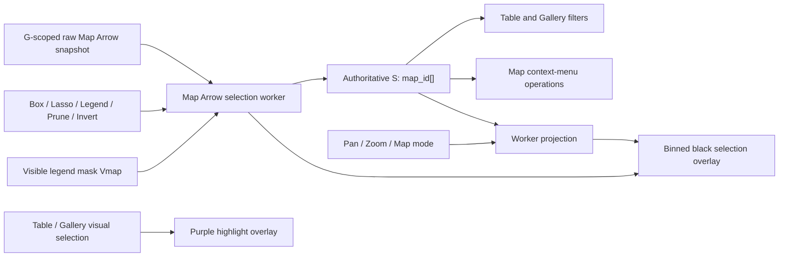

# SC Inspection Workbench Filter Contract

## Status

The **AS-IS** sections describe the behavior currently implemented by
`InspectionQuad`, `useSqlInspectionModel`, `inspectionFilterPolicy.ts`, and the
SQL workbench datasource. The **TO-BE** sections define the normative
three-layer filter model. The filter ownership, recursive Global Filter expression tree,
Map-selection promotion, and structured Train & Predict transport described
there are implemented; remaining work must be called out explicitly instead
of treating TO-BE as aspirational shorthand.

This document is the source of truth for filter ownership and query scope in SC
Preview and Reclassify. UI changes must update this contract and its
state-matrix tests in the same change.

## State ownership

`InspectionQuad` owns one Global Filter and the workbench-local interaction
state. The states have different lifetimes and must not be mirrored into one
another:

- **Global Filter** is the only persistent query filter. It is an ordered,
  recursive tree of stable-ID conditions and `AND`/`OR` groups edited by the
  shared `QueryBuilder`. QueryBuilder edits remain in a modal-local draft;
  only **Apply filters** replaces the active Global Filter. Closing or cancelling
  the modal discards the draft without reloading any consumer. Map context actions add ordinary `map_id`
  conditions; an excluded set uses `exclude: true`. There is no second applied
  map-filter list.
- **Transient map selection** is the sorted, unique set of IDs produced by box,
  lasso, legend, or group-distribution selection. It immediately narrows the
  table and gallery, but does not alter the map, distribution, or Global Filter
  until the user chooses an explicit map context action.
- **Legend visibility** is an ephemeral Map-only mask keyed by the active legend
  source. It is not G, T, Y, or a fourth persistent filter layer, but it bounds
  the Map-visible selection universe. Hidden points cannot enter or remain in
  the transient map selection.
- **Review mode**, **active sampling cohort**, **table-column filters/sort**, and
  **table row selection** are local workbench constraints or modifiers. They
  never mutate the Global Filter.

G evaluates its own explicit `AND`/`OR` expression. Independently owned layers
compose as `G AND T AND Y`; changing one source does not implicitly clear
another. A workbench scope change resets all local state; the user may
otherwise clear each state explicitly. The active transient map selection,
table-column filters, and sampling cohort are displayed beside the Global
Filter as counted clear actions, so a T-layer constraint cannot silently leave
the table and gallery blank.

The **Map-visible universe**, written `Vmap`, is the set emitted by the current
G-filtered Map query and active projection after applying the active legend
visibility mask. Selection gestures and Map context operations may only operate
on this set. Legend visibility remains Map-local and does not directly filter
the table, gallery, sampling candidates, distribution, or Train & Predict.

## AS-IS: current filter assembly

The word “filter” is used at several different layers. These layers must stay
separate; sharing a field such as `defect_id` does not make two filters the same
state. The current implementation is described below as four assembly stages,
not as the target product-level filter layers.

### Stage 1: owned interaction state

| State                      | Owner / representation                                                                         | Mutation                                                                       | Lifetime                                      |
| -------------------------- | ---------------------------------------------------------------------------------------------- | ------------------------------------------------------------------------------ | --------------------------------------------- |
| Global Filter              | `InspectionQuad.globalFilter`; recursive `ScGlobalFilter` expression tree                      | Confirmed Global Filter QueryBuilder draft or an explicit committed map action | Persistent within the current workbench scope |
| Global Filter editor draft | `ScGlobalFilterModal.draftFilter`; cloned recursive `ScGlobalFilter` expression tree           | QueryBuilder edits; Apply replaces G, Cancel/close discards                    | One modal editing session                     |
| Transient map selection    | `useSqlInspectionModel.mapSelection.ids`                                                       | Box/lasso append; legend/distribution replace; explicit clear                  | Until cleared, committed, or scope changes    |
| Legend visibility mask     | `ScMapPanelBinned.hiddenLegendKeysBySource`, mirrored by `InspectionQuad` for query resolution | Legend visibility toggles; reset on workbench scope change                     | Workbench-local Map presentation/selection    |
| Review mode                | `useSqlInspectionModel.reviewMode`                                                             | Patch/Review gallery switch                                                    | Workbench-local                               |
| Active sampling cohort     | `galleryRandomSamplingDefectIds`; fixed ID set                                                 | Successful sampling result or explicit clear                                   | Workbench-local                               |
| Table-column filter        | `InspectionQuad.tableFilter`; `ScSampleTableFilter`                                            | Table filter controls                                                          | Workbench-local                               |
| Table sort                 | `InspectionQuad.tableSort`                                                                     | Table header sort                                                              | Workbench-local ordering, not a predicate     |
| Table row selection        | `useSqlInspectionModel.tableSelection`; explicit row keys or symbolic select-all exclusions    | Table selection controls                                                       | Workbench-local                               |
| Sampling candidate options | One scope: `all`, `map`, or `table`; plus an independent recursive Extra filter                | Sampling dialog                                                                | Used only while building a sampling query     |

None of the local states is copied into the Global Filter. A modal editor draft
replaces G only after **Apply filters**. The other exception is an explicit map
commit: the reducer appends one independently removable `map_id` item and
then clears the transient selection.

### Stage 2: normalized policy filters

`inspectionFilterPolicy.ts` is the only place that converts owned workbench
state into the base query plan:

| Policy output              | Exact contents                                                                                                                             |
| -------------------------- | ------------------------------------------------------------------------------------------------------------------------------------------ |
| `globalFilters`            | `buildScGlobalDataFilters(Global Filter)`                                                                                                  |
| `mapFilters`               | `globalFilters`                                                                                                                            |
| `aggregateFilters`         | `globalFilters`                                                                                                                            |
| `tableFilters`             | `globalFilters AND transient map selection AND active sampling cohort AND review predicate`                                                |
| `galleryBaseFilters`       | `globalFilters AND transient map selection AND active sampling cohort AND review predicate`                                                |
| Sampling candidate filters | Global Filter `AND` optional recursive Extra filter `AND` exactly one candidate scope (`all`, transient map selection, or table selection) |

The normalized `ScDataFilterExpression` is either an execution-neutral tuple
such as `["map_id", "in", [3, 9]]` or a recursive `{ combinator, items }`
group. A negative set becomes
`["map_id", "not in or null", [3, 9]]`.

Naming is intentionally strict: `tableFilters` (plural) is the policy-produced
base filter array, while `tableFilter` (singular) is the user-edited
table-column filter object. They are composed in the datasource and must not be
aliased or synchronized.

### Stage 3: datasource-local filters

The SQL datasource adds only filters owned by the target surface:

| Consumer                       | Base policy input          | Datasource-local additions                                                                          |
| ------------------------------ | -------------------------- | --------------------------------------------------------------------------------------------------- |
| Map                            | `mapFilters`               | Reticle projection, legend column, and client-side legend visibility mask                           |
| Group distribution             | `aggregateFilters`         | Requested group field; no local filter                                                              |
| Map Arrow selection resolution | `mapFilters` snapshot      | Worker-local visibility mask plus the current geometric, legend, ID-set, prune, or invert operation |
| Table                          | `tableFilters`             | Table-column filter; table sort changes ordering only                                               |
| Gallery                        | `galleryBaseFilters`       | Table-column filter, table row selection, and table sort; mode changes projection/rendering only    |
| Sampling count/groups/IDs      | Sampling candidate filters | Requested aggregate field or sampling program/seed                                                  |

Review membership is owned by T and is already present exactly once in both
`tableFilters` and `galleryBaseFilters`. `loadGallery()` uses its mode only to
select Patch or Review projection/rendering columns; it does not infer or
inject membership filtering.

### Stage 4: execution and submission filters

Interactive queries compile `ScDataFilterExpression[]` into parenthesized,
parameterized SQL. Direct dataset Train & Predict instead submits the recursive
Global Filter as `sample_filter`; the training request validates every group,
combinator, field, and condition, and the SC workflow applies the same Boolean
tree to its LazyFrame. Local workbench layers are never serialized into that
payload.



The diagram shows data dependencies, not state mutation. The only feedback
edge is the explicit map commit reducer; ordinary table, gallery, Review, and
sampling operations never feed back into the Global Filter.

Implementation anchors:

| Concern                                       | Source of truth                                                                                  |
| --------------------------------------------- | ------------------------------------------------------------------------------------------------ |
| State ownership and map commits               | `InspectionQuad.vue`                                                                             |
| Workbench filter composition                  | `application/inspectionFilterPolicy.ts`                                                          |
| Structured Global Filter to normalized tuples | `application/workbenchDataFilter.ts`                                                             |
| Query wiring and map/aggregate watchers       | `presentation/composables/useSqlInspectionModel.ts`                                              |
| Table/Gallery local SQL composition           | `api/sqlWorkbenchDataSource.ts`                                                                  |
| Train & Predict Global Filter selection       | `application/useReclassifyPage.ts` and `presentation/pages/ReclassifyPage.vue`                   |
| Backend workflow validation/execution         | `apps/api/app/modules/sc/schemas.py` and `apps/api/app/modules/sc/app/services/sample_filter.py` |

## Review Sampling execution contract

Review Sampling is an interactive data-plane query, not a control-plane job and
not a new persisted dataset field. The candidate predicate is assembled in this
order:

```text
current Global Filter
  AND optional recursive Extra filter
  AND one candidate scope (All / Map Selection / Table Selection)
```

`All` adds no selection predicate and is the default. `Map Selection` adds the
current transient map IDs. `Table Selection` adds the table's explicit IDs, or
the compact select-all exclusion predicate when the table uses symbolic
select-all state. Review mode and the active sampling cohort are deliberately
not candidate inputs.

The web datasource compiles only the candidate predicate into a parameterized,
read-only source query and sends the enabled rules as a structured program. The
SC data-provider validates the source query, maps the transport program to
`libs/sampling-rules`, and lets that library compile the conditional limit, group
quota, and total-limit CTE stages. The final statement is validated again and
executed over the materialized `samples` view, returning Arrow IPC containing
only `defect_id`. No user value is interpolated into SQL text.

The structured program is an ordered pipeline. Each of the 17 typed rules
consumes only the rows emitted by the previous rule; filters, selectors,
distribution draws, and caps are not regrouped into canonical phases. The UI
must preserve this order and expose explicit move controls. With a fixed seed,
replaying the same candidate relation and the same ordered program is
deterministic; changing the order is a semantic change.

For group sampling, `sample ratio` is a percentage of each group's population:
`2` applied to a group of 1,000 yields 20 candidates. It is not a percentage of
the final total limit. The `Others` branch is the `CASE ... ELSE` target for
every group without an explicit target. Count requests larger than the available
group naturally take all available rows. `FLOOR`, `CEIL`, or `ROUND` is applied
before the final total limit.

Every conditional, group, and final ordering hashes the stable source identity
with the fixed seed `42`, so an unchanged candidate set and rule program reproduce
the same cohort. The Python `sampling-rules` library is the production owner of
these sampling stages and executes them through its DuckDB table backend. Its
mapping-based executor remains a compatibility surface for bounded callers.

## TO-BE: three cumulative filter layers

### Goals and invariants

The workbench shall expose exactly three **logical ownership layers**. Each
downstream surface inherits the layers above it:

| Layer                 | Owned sources                                                                                                  | Consumers                                                                                                         | Explicitly not owned by this layer                                                 |
| --------------------- | -------------------------------------------------------------------------------------------------------------- | ----------------------------------------------------------------------------------------------------------------- | ---------------------------------------------------------------------------------- |
| **G · Global Filter** | Recursive condition groups joined by explicit `AND`/`OR`, including committed map include/exclude conditions   | Map, distribution, map-selection queries, table, gallery, direct-dataset Train & Predict, and all sampling scopes | Transient map selection, Review, sampling cohort, table controls, gallery controls |
| **T · Table Extra**   | Transient map selection, Review predicate, active sampling cohort, and table-column filter                     | Table and gallery only                                                                                            | Map, distribution, ordinary map-selection queries, Train & Predict                 |
| **Y · Gallery Extra** | Table row-selection constraint: explicit IDs or symbolic select-all exclusions; future gallery-only predicates | Gallery only                                                                                                      | Table, map, distribution, sampling, Train & Predict                                |

The layer names describe ownership and inheritance, not a requirement that all
state is immediately flattened into `ScDataFilterExpression[]`. The structured table
filter must still be validated against the datasource's allowed columns, and a
symbolic table row selection must still be compiled by the datasource.

The effective predicates are:

```text
Map                     = G
Group distribution      = G
Map-visible universe Vmap = G-filtered Map rows AND active legend visibility mask
Map Arrow worker selection = G-scoped Arrow snapshot AND Vmap AND current operation
Transient map selection S is always a subset of Vmap
Table                   = G AND T
Gallery                 = G AND T AND Y
Direct Train & Predict  = structured G only
```

Conditions within G compose with the combinator of their containing group.
Separately owned layers compose with logical `AND`. There is no standalone
applied-map filter and no fourth persistent filter layer.

### Global Filter expression-tree contract

The Global Filter is an ordered Boolean expression tree. It is neither a record
keyed by property nor a flat condition list:

```ts
type ScFilterCombinator = "and" | "or";

interface ScGlobalFilter {
  combinator: ScFilterCombinator;
  items: readonly ScGlobalFilterNode[];
}

interface ScGlobalFilterGroup {
  kind: "group";
  id: string;
  combinator: ScFilterCombinator;
  items: readonly ScGlobalFilterNode[];
}

interface ScGlobalFilterItem {
  id: string;
  field: string;
  condition: ScFilterCondition;
  source:
    | { kind: "manual" }
    | {
        kind: "map-selection";
        action: "exclude-selected" | "include-only";
      };
}

type ScGlobalFilterNode = ScGlobalFilterItem | ScGlobalFilterGroup;
```

Condition and group `id` values plus condition `source` are workbench-domain
metadata. `source` does not alter predicate semantics and need not be
interpreted by SQL or workflow execution. Execution transport omits UI-only
IDs/provenance but preserves group boundaries, combinators, order, and repeated
properties.

`id`, rather than `field`, is the item identity. The following rules are
normative:

1. Every group explicitly owns one `AND` or `OR` combinator. Nested groups
   establish parentheses; no implicit precedence or flattening is allowed.
2. The same property may appear in multiple G conditions. It may also
   independently appear in T or Y. Composition never deduplicates predicates
   by property.
3. Node order is preserved for display, transport, and deterministic parameter
   order. Reordering siblings must not flatten or move them across a group
   boundary.
4. Deleting a condition removes exactly that predicate. Deleting a group
   removes that subtree. No hidden map filter or merged condition remains.
5. Opening the modal clones G into a modal-local editor draft. **+ Condition**
   starts an inline rule in its selected group; **+ Group** adds a nested group.
   Incomplete conditions, including a set condition with no selected values,
   and empty groups remain editor-local and are absent from the effective draft
   expression. An unfinished empty include must never compile to `FALSE` and
   blank every workbench result.
6. Completing, deleting, or reordering conditions changes only the modal-local
   draft. **Apply filters** atomically replaces G once and then closes the modal.
   **Cancel**, the close control, mask close, and Escape discard the draft. None
   of those editing operations issues filtered Map, distribution, Table, or
   Gallery queries before confirmation.
7. The displayed Global Filter count is the number of complete conditions, not
   the number of groups or distinct properties.
8. Every completed row shows its Property, Operator, and Value without another
   click. The editor uses inherited theme colors and remains readable in light
   and dark themes. Explanatory scope copy is not repeated inside the modal.
9. Set editors expose **Select all (N)**. It selects or clears the currently
   visible, loaded options; when search is active it operates only on matching
   visible options and preserves selections outside that result.
10. `QueryBuilder` in `src/shared/components/query-builder/` owns only generic
    tree interaction. `ScGlobalFilterQueryBuilder` adapts SC fields, operators,
    values, and effective-filter serialization.

For example, nested logic and repeated properties remain visible and separately
removable:

```text
Global Filter

  AND
  ├─ OR
  │  ├─ class_number  is any of     [2]
  │  └─ class_number  is any of     [3]
  AND
  └─ defect_id       excludes      [12, 19]

  [ + Condition ] [ + Group ]
```

Map context actions add ordinary G conditions; they do not mutate or merge an
existing condition:

| Context action                            | Condition AND-composed with G               | Follow-up state change                 |
| ----------------------------------------- | ------------------------------------------- | -------------------------------------- |
| **Exclude selected**                      | `defect_id NOT IN OR NULL (<selected IDs>)` | Clear the transient map selection in T |
| **Include only** / **Exclude all others** | `defect_id IN (<selected IDs>)`             | Clear the transient map selection in T |

Each invocation constrains the current cohort as `G AND committedCondition`.
For an empty or `AND` root, the condition is appended to that root. For an `OR`
root, the existing root becomes one nested `OR` group under a new `AND` root,
with the committed condition as its sibling. This prevents **Exclude selected**
from accidentally broadening an OR cohort. Repeating it builds an `AND` chain
of visible exclusions. Deleting one generated condition cancels only that
invocation; a separate undo history is unnecessary.

Appending the G item and clearing the transient selection are one logical
commit transaction:

```text
before:  G AND T.transient(defect_id IN selected)
commit:  AND-compose the new defect_id condition with G
         clear T.transient and its map-only selection visuals
after:   updated G, with no transient selected-ID predicate
```

On a successful **Exclude selected** or **Include only** commit, the workbench
must clear the transient selected-ID set, selection count, selection geometry,
and any legend/bar/crosshair highlight owned by that transient selection. It
must not clear Review, active sampling cohort, table filter/sort, table row
selection, gallery annotation selection, or any pre-existing G item. Consumers
must not observe an intermediate query containing both the newly committed G
predicate and the stale transient selected-ID predicate.

If validation or append fails, G remains unchanged and the transient selection
is retained so the user can retry. The failure must not look like a successful
apply followed by an empty selection.

Filter-editor helper queries must also use item identity. Numeric range lookup
for an edited item uses `G minus that item ID`, preserving every other item,
including other items for the same property. The AS-IS distinct-value lookup
remains unfiltered unless a separate product decision changes its scope.

### Target ownership model

The target API should preserve structured state until the consumer that can
validate and compile it. A conceptual shape is:

```ts
interface ScInspectionFilterLayers {
  global: {
    structuredFilter: ScGlobalFilter;
    predicates: readonly ScDataFilterExpression[];
  };
  tableExtra: {
    predicates: readonly ScDataFilterExpression[];
    columnFilter: ScSampleTableFilter;
  };
  galleryExtra: {
    rowSelection: ScTableSelectionConstraint;
  };
}
```

Every complete condition in `global.structuredFilter` compiles in place inside
its parent expression; duplicate fields remain separate conditions.
`tableExtra.predicates` contains the already-normalized transient map
selection, Review, and active sampling cohort predicates. It does not contain
the table-column filter twice. `galleryExtra.rowSelection` remains symbolic
until the datasource converts it to `row_key IN (...)` or
`row_key NOT IN (...)`.

### Physical row identity

`row_key` is a required physical column of every materialized SC workbench
sample source. It is not assembled by pagination SQL:

- inspection materialization writes
  `<inspection_time>::<wafer_key>::<defect_id>`;
- dataset materialization retains `sample_id` separately and writes the stable
  workbench `row_key` into the cached Parquet source;
- a future multi-inspection or collection source must namespace member sample
  identity before union so `row_key` remains unique across members.

The data-provider cache format is versioned with this contract. A cache without
physical `row_key` is rebuilt after a format bump and is rejected with an
explicit identity-contract error if it reaches query registration. The browser
may recognize `sample_id` or inspection-scoped `defect_id` only as a temporary
read-compatibility path for old data; new sources and cross-inspection joins
must use `row_key`.

Ordering, projection, and spatial context accompany the three layers but are
not predicates:

| Modifier / context        | Scope                            | Contract                                                                                                    |
| ------------------------- | -------------------------------- | ----------------------------------------------------------------------------------------------------------- |
| Table sort                | Table and gallery                | Shared ordering only; never changes membership                                                              |
| Gallery Patch/Review mode | Gallery projection and rendering | Chooses fields/presentation. The Review membership predicate belongs to T and is applied exactly once       |
| Reticle projection        | Map queries                      | Changes the spatial projection/query context, not filter ownership                                          |
| Legend group field        | Map and distribution queries     | Changes grouping/query shape                                                                                |
| Legend visibility mask    | Map rendering and selection      | Hides rendered points and bounds `Vmap`; never becomes a G/T/Y predicate or directly filters other surfaces |

### Target data flow



The arrows express query inheritance only. State does not flow back upward.
The sole promotion operation is an explicit map commit: it appends a visible,
independently removable `defect_id` item to G, then clears only the transient
selection in T. Applying random sampling stores the resulting fixed cohort in
T. Table row selection remains in Y.

The Map Arrow worker returns the authoritative transient `map_id[]` set stored
in T. That set is the input to **Exclude selected**,
**Include only / Exclude all others**, invert, and copy-ID context-menu
operations. Map cross marks are presentation derived from the selection; they
are not the selection contract or a source of IDs:

- the Arrow snapshot already contains the complete G-scoped raw Map rows;
- every resolver path (box, lasso, legend, distribution, select-all, prune, and
  invert) runs inside the Map Arrow worker against `Vmap`, so it does not issue
  a server selection query and hidden legend values cannot be added;
- when the active legend source or its hidden-key set changes, the workbench
  serially replaces `S` with `S ∩ Vmap` before a context-menu operation may
  read it; each queued visibility change reads S only after the prior prune;
- stale worker results are rejected by the workbench selection version and
  cannot overwrite a newer replace, clear, or scope transition;
- unhiding a legend value does not restore previously pruned IDs; the user must
  select them again;

- the same worker operation that updates S also returns a binned black
  selection overlay; there is no separate gesture-preview/ID-resolution chain;
- projection responses include the current selection overlay for every
  selection size; the old 9,999-ID omission does not apply to Map selection;
- pan and zoom change only the viewport projection. They must not clear S or
  its overlay; the previous overlay remains visible until the new projection
  arrives;
- purple cross marks visualize Table/Gallery highlight selection and belong to
  separate non-filter UI state.



Consequently, context-menu behavior and query filtering must always read T,
never reconstruct IDs from visible cross marks. Clearing T after a successful
commit also clears only the black transient-selection visuals.

### Auxiliary queries and lifecycle

The following paths are intentionally outside the three persistent layers and
must not be forced into a fourth layer:

- **Sampling candidate construction** is an on-demand branch. The dialog may
  enable G, the Review source from T, and the current transient-map-selection
  source from T. Program, quota, grouping, and seed constrain the selection
  algorithm; they are not workbench filters. A successful result becomes the
  active sampling cohort in T.
- **Global Filter option lookup** is scoped for editing G, not for displaying a
  workbench surface. Distinct-value lookup is currently unfiltered. Numeric
  range lookup is `G minus the edited item ID`, so other items for the same
  field remain active.
  Neither query inherits T or Y.
- **Map selection resolution** is a frontend Map Arrow worker operation over
  the G-scoped raw snapshot. `Vmap` plus its geometric, legend, ID, prune, or
  invert constraint produces both authoritative IDs and a binned overlay.
  Context-menu operations read the visibility-pruned IDs, never canvas pixels.
- **SSE invalidation** triggers reloading but does not change filter ownership.
  Every reload must use the consumer's current effective layers.
- **Workbench scope changes and explicit clears** are lifecycle operations.
  A scope change in variant, dataset, collection, collection revision,
  inspection time, or wafer resets Global Filter and all local state according
  to the existing workbench lifecycle; it does not introduce a filter layer.
  Pending visibility prunes and waiting context actions from the old scope are
  discarded and cannot write into the new scope.
- **Gallery visual/annotation selection and highlight** are UI state. They must
  not be confused with table row selection and must not become query
  predicates.

## Feature preservation audit

| Feature / behavior                         | AS-IS behavior                                                                                                        | TO-BE placement                 | Preservation requirement or remaining gap                                                                                       |
| ------------------------------------------ | --------------------------------------------------------------------------------------------------------------------- | ------------------------------- | ------------------------------------------------------------------------------------------------------------------------------- |
| Global Filter representation               | Recursive stable-ID `ScGlobalFilter` expression tree with explicit `AND`/`OR` groups                                  | G                               | Implemented across frontend state, OpenAPI DTOs, SQL, and workflow validation                                                   |
| Repeated property predicates               | Multiple conditions for the same property compile independently                                                       | G and independently T/Y         | Preserve; never overwrite or deduplicate by property                                                                            |
| Global Filter QueryBuilder UI              | Conditions/groups support combinators, nesting, sibling reorder, and exact Delete                                     | G editor                        | Count complete conditions only; incomplete rules and empty groups remain non-effective                                          |
| Global set/range/missing predicates        | Structured Global Filter is normalized for interactive SQL                                                            | G                               | Preserve all operators, missing-value behavior, and numeric `defect_id` canonicalization                                        |
| Negative and empty-set semantics           | Negative sets retain missing values; an unfinished empty include or exclude is omitted                                | G                               | Never turn an editor draft with no selected values into a match-none predicate                                                  |
| Committed map include/exclude              | Promotion AND-composes one Global `map_id` condition and clears transient selection                                   | Promotion from T to G           | Wrap an OR root before adding the condition; never broaden the cohort or create a hidden map-filter list                        |
| Independently removable map commits        | Repeated map commits remain separate stable-ID conditions                                                             | G expression tree               | Preserve; deleting one condition cancels only that action                                                                       |
| Post-commit transient cleanup              | Successful commit clears selected IDs and map selection highlights                                                    | T lifecycle                     | Apply G append and transient cleanup as one logical transition; preserve unrelated state and retain selection when commit fails |
| Legend visibility and Map selection        | Worker masks hidden legend keys and prunes existing T selection                                                       | Map-local `Vmap` constraint     | Preserve `S ⊆ Vmap`; invert uses `Vmap \ S`; unhide never restores IDs; hidden keys never become G/T/Y predicates               |
| Box/lasso selection                        | Worker appends exact raw-row IDs and returns the binned overlay in one operation                                      | T                               | Preserve append and unique/sorted semantics; never select from canvas bins                                                      |
| Legend/distribution selection              | Worker replaces transient IDs and overlay in one operation                                                            | T                               | Preserve replace semantics                                                                                                      |
| Review                                     | T supplies `images > 0` exactly once to table and gallery; gallery mode controls projection only                      | T                               | Preserve exactly-once compilation                                                                                               |
| Active random-sampling cohort              | Fixed ID set narrows table and gallery                                                                                | T                               | Preserve; never promote to G or Train & Predict                                                                                 |
| Table-column filter                        | Datasource adds structured table filter to table and gallery                                                          | T                               | Preserve datasource allowed-column validation; do not prematurely flatten or duplicate it                                       |
| Table sort                                 | Orders table and gallery                                                                                              | T-adjacent modifier             | Preserve shared order; never treat it as membership filtering                                                                   |
| Table row selection                        | Explicit IDs or select-all exclusions narrow gallery only                                                             | Y                               | Preserve symbolic select-all exclusions and gallery-only scope                                                                  |
| Gallery annotation/highlight selection     | Visual/annotation UI state                                                                                            | Outside layers                  | Preserve as non-filter state                                                                                                    |
| Sampling candidate count/groups/IDs        | Optional G, Review, and transient selection feed an on-demand sampler                                                 | Auxiliary branch                | Preserve independent options; cohort result enters T, but algorithm parameters do not                                           |
| Global distinct-value options              | Query currently uses no workbench filters                                                                             | Auxiliary G editor query        | Preserve current scope unless a separate product decision changes it; never inherit T/Y accidentally                            |
| Global numeric range                       | Query uses G with only the edited item ID removed                                                                     | Auxiliary G editor query        | Preserve other same-property items and isolation from T/Y                                                                       |
| Map, aggregate, and ordinary map selection | Map/aggregate use G; Arrow worker resolves selection from the same G snapshot using `Vmap` plus the current operation | G plus ephemeral Map constraint | Preserve map independence from T/Y while enforcing `S ⊆ Vmap`; do not add a server selection round trip                         |
| Reticle projection                         | Alters map spatial query/drawing context                                                                              | Orthogonal context              | Preserve; it is not a filter layer                                                                                              |
| Legend grouping and hidden keys            | Group field affects query shape; hidden keys are visual                                                               | Orthogonal context              | Preserve; hidden keys must not become predicates                                                                                |
| Direct-dataset Train & Predict             | Sends only the recursive Global Filter expression as `sample_filter`                                                  | G                               | Preserve group boundaries, combinators, repeated properties, and exclusion of every T/Y source                                  |
| Collection-revision Train & Predict        | `sample_filter` is unsupported and omitted                                                                            | Separate contract boundary      | Keep unsupported until an explicit collection-filter runtime contract exists                                                    |
| SSE invalidation                           | Reloads affected consumers                                                                                            | Lifecycle trigger               | Preserve each consumer's effective G/T/Y scope during reload                                                                    |
| Scope reset and explicit clears            | Scope changes include collection revision; visible actions clear map selection, table filters, or sampling cohort     | Lifecycle                       | Preserve independent clears; no implicit cross-layer mutation                                                                   |

The audit finds no current user-facing behavior that requires a fourth
persisted filter layer. The recursive G schema and the single T ownership of
Review are implemented. The three cumulative equations remain complete only
when the auxiliary queries, non-predicate modifiers, and lifecycle rules above
stay explicit.

## Query scope matrix: invariant before and after refactor

| State / operation                      | Map                        | Group distribution | Map Arrow selection worker | Table         | Gallery       | Sampling candidates                     | Direct Train & Predict |
| -------------------------------------- | -------------------------- | ------------------ | -------------------------- | ------------- | ------------- | --------------------------------------- | ---------------------- |
| Global Filter fields                   | Yes                        | Yes                | Yes                        | Yes           | Yes           | When enabled                            | Yes                    |
| Committed map include/exclude          | Yes, through Global Filter | Yes                | Yes                        | Yes           | Yes           | When Global Filter is enabled           | Yes                    |
| Legend visibility mask                 | Yes, rendering mask        | No                 | Yes, bounds `Vmap`         | No            | No            | No                                      | No                     |
| Transient map selection                | No                         | No                 | No                         | Yes           | Yes           | When “current map selection” is enabled | No                     |
| Review membership predicate            | No                         | No                 | No                         | Yes           | Yes           | When “review candidates” is enabled     | No                     |
| Active sampling cohort                 | No                         | No                 | No                         | Yes           | Yes           | No                                      | No                     |
| Table-column filter                    | No                         | No                 | No                         | Yes           | Yes           | No                                      | No                     |
| Table sort                             | No                         | No                 | No                         | Ordering only | Ordering only | No                                      | No                     |
| Table row selection                    | No                         | No                 | No                         | No            | Yes           | No                                      | No                     |
| Gallery annotation/highlight selection | No                         | No                 | No                         | No            | No            | No                                      | No                     |

In the AS-IS implementation, T supplies the Review predicate exactly once to
both table and gallery. Gallery mode controls projection and rendering only.

The Train & Predict column currently applies to direct `image_sc` dataset
workbenches. Collection-revision submission does not yet accept
`sample_filter`, so the collection UI must not serialize a Global Filter into
that unsupported field. Adding filtered collection training requires an
explicit runtime collection-filter contract; it must not silently reinterpret
collection row keys as physical dataset IDs.

## Map selection transitions

### AS-IS

1. Box and lasso selections append IDs. Legend and group-distribution
   selections replace IDs. Every path resolves candidates against `Vmap`, not
   all rows in G.
2. A non-empty transient selection immediately adds
   `map_id IN (<selected IDs>)` to table and gallery queries.
3. Changing the active legend source or its hidden values prunes the current
   selection to `S ∩ Vmap`, clears stale selection visuals, and supersedes
   pending area-selection queries. Unhiding values does not re-add IDs.
4. **Exclude selected** AND-composes one negative-set `map_id` condition with G.
5. **Exclude all others** AND-composes one positive-set `map_id` condition with G.
6. A committed map action waits for visibility pruning, then clears the
   transient selection and its owned black
   cross marks. The map then reloads from the complete updated G expression.
   Repeating selection followed by **Exclude selected** therefore performs
   continuous exclusion against the remaining map without merging prior
   actions.
7. There is no undo history. Every committed action is visible as an
   independently removable Global Filter condition.

### TO-BE

1. Box/lasso append and legend/group-distribution replace behavior remains
   unchanged. Candidate IDs are limited to `Vmap`, and the resolved IDs are
   stored as transient selection in T.
2. **Exclude selected** adds one visible G condition with field `map_id` and
   negative-set semantics. It does not rewrite an existing `map_id`
   condition. If the root is OR, it is wrapped so the result is
   `previousG AND excludedCondition`.
3. **Include only** / **Exclude all others** adds one visible G condition with
   positive-set semantics, using the same AND-composition.
4. The committed action clears the transient selection. The map reloads from
   the complete G expression. The G update and transient clear form one logical
   state transition; consumers never query with both the new G condition and
   the stale transient ID predicate.
5. Repeating a context action adds another condition. Removing that condition
   from the Global Filter cancels exactly that committed predicate and reloads G
   consumers; no undo stack or hidden applied-map list is needed.
6. Dragging generated or manual sibling nodes only changes display order. All
   nodes retain their stable IDs and their containing group's semantics.
7. A failed commit preserves the transient ID set and its selection visuals so
   the operation can be retried.
8. Invert is `Vmap \ S`, not `G \ S`. Copy and every include/exclude context
   action wait for current visibility pruning and read the same authoritative S.

An empty included-set condition is a valid match-none condition. An empty
excluded set has no effect and is not committed as a complete condition.

`map_id` is an integer identity even when a transport model represents JSON
numbers as floating-point values. SQL and workflow execution adapters must
therefore compare integral values canonically: `1` and `1.0` identify the same
defect. Negative filters preserve rows whose filtered field is missing.

## Sampling

The sampling dialog builds candidates from the three options it exposes:
Global Filter, Review candidates, and current transient map selection. Applying
the result creates a fixed local cohort. The cohort narrows only table and
gallery and does not become a Global Filter or a Train & Predict condition.

## Regression requirements

Changes to this area require tests that assert:

- the complete query scope matrix;
- the derived G, G+T, and G+T+Y predicates and each layer's independence;
- nested Global Filter `AND`/`OR` groups retain parentheses and deterministic
  parameter order across interactive SQL and direct Train & Predict;
- multiple conditions for the same property remain independent and are never
  overwritten by property;
- condition/group deletion removes only the addressed stable node;
- sibling reordering preserves IDs, group boundaries, and result membership;
- incomplete **+ Condition** drafts and empty **+ Group** nodes do not enter G
  or issue filtered queries;
- Set **Select all** selects current visible options, supports partial state,
  and preserves selected options outside an active search;
- box, lasso, legend, distribution, select-all, and invert selection resolve
  only IDs in `Vmap`, including missing-value legend categories;
- hiding a legend value prunes matching IDs from an existing transient
  selection, its black cross marks, context-menu commits, and copied IDs;
- context-menu actions wait until the visibility queue is stable, including
  visibility changes appended while the action is already waiting;
- a visibility prune that overlaps a newer append/replace selection rechecks
  the latest S and cannot overwrite it with stale IDs;
- scope reset or unmount invalidates pending visibility prunes and cancels
  context actions that were waiting on them;
- changing legend source supersedes pending selection queries and re-prunes S
  against the new source's visibility mask;
- unhiding a legend value, including before a preceding hide query completes,
  never restores previously pruned IDs, and invert is exactly `Vmap \ S`;
- legend visibility never enters G/T/Y and never directly changes distribution,
  table, gallery, sampling, or Train & Predict membership;
- each map include/exclude commit AND-composes one visible `defect_id` condition, clears
  transient selection, and supports continuous repeated exclusion;
- a successful map commit clears all transient-selection-owned map visuals but
  preserves every unrelated G/T/Y state;
- a failed map commit leaves G and transient selection unchanged;
- derived consumers never observe the new committed G condition together with the
  stale transient selected-ID predicate;
- Review and sampling changes do not issue map or aggregate requests;
- committed map actions do issue map/aggregate requests and clear transient
  selection;
- gallery Review filtering is applied exactly once;
- table-column filters are validated and compiled once for table and gallery;
- explicit and symbolic select-all table row selections affect gallery only;
- table sort changes ordering without changing predicate membership;
- Global Filter distinct/range option queries never inherit T or Y, and a
  TO-BE range query excludes only the edited item ID;
- sampling candidate options select only their documented G/T sources, and the
  resulting cohort enters T without changing G;
- SSE invalidation reloads each consumer with its current effective layers;
- direct-dataset Train & Predict receives Global Filter conditions but never
  local Review, sampling, table, or transient-selection conditions;
- OpenAPI request validation preserves nested groups, combinators, order, and
  duplicate-property conditions rather than converting them to a property-keyed record;
- workflow include/exclude tests cover numeric `defect_id` values after request
  parsing, including missing-value behavior.
