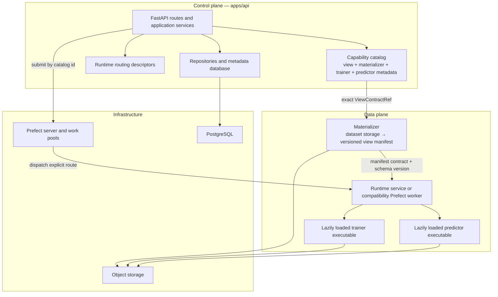

# System Design Diagram

The catalog contains import-safe metadata only. Executable trainer and predictor
modules are imported at worker execution time, never during API startup.
SC's Torch-free adapters live under `apps/api/app/modules/sc/runtime/`; their
optional Torch/Ultralytics implementations live in `libs/ml`. New production ML
implementations can move to an out-of-process runtime service and consume
versioned data-plane manifests.

See [Architecture Overview](overview.md),
[Runtime Registration Contract](runtime-registration-contract.md), and
[View Contract Foundation](view-contract-foundation.md).
