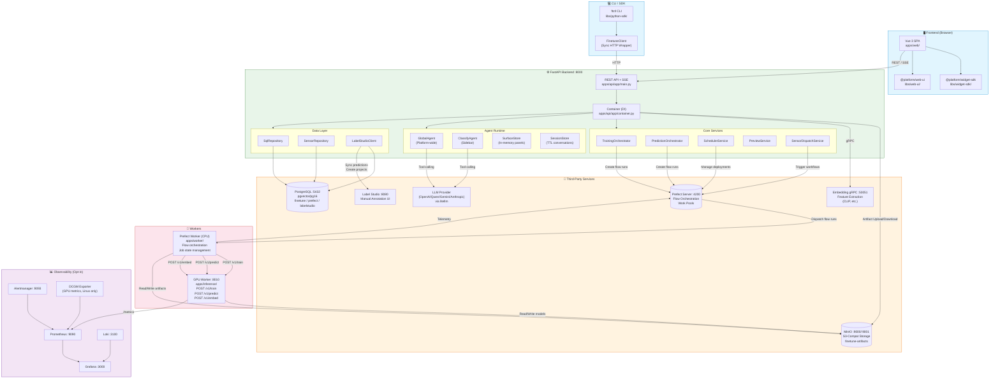

# System Design Diagram

```mermaid
graph TB
    subgraph Frontend["🖥️ Frontend (Browser)"]
        VueApp["Vue 3 SPA<br/>apps/web/"]
        WidgetSDK["@platform/widget-sdk<br/>libs/widget-sdk/"]
        WebUI["@platform/web-ui<br/>libs/web-ui/"]
        VueApp --> WidgetSDK
        VueApp --> WebUI
    end

    subgraph CLI["💻 CLI / SDK"]
        Ftctl["ftctl CLI<br/>libs/python-sdk/"]
        FinetuneClient["FinetuneClient<br/>(Sync HTTP Wrapper)"]
        Ftctl --> FinetuneClient
    end

    subgraph Backend["⚙️ FastAPI Backend :8000"]
        direction TB
        API["REST API + SSE<br/>apps/api/app/main.py"]
        Container["Container (DI)<br/>apps/api/app/container.py"]

        subgraph Services["Core Services"]
            TrainingSvc["TrainingOrchestrator"]
            PredictionSvc["PredictionOrchestrator"]
            SchedulerSvc["SchedulerService"]
            PreviewSvc["PreviewService"]
            SensorSvc["SensorDispatchService"]
        end

        subgraph Agent["Agent Runtime"]
            GlobalAgent["GlobalAgent<br/>(Platform-wide)"]
            ClassifyAgent["ClassifyAgent<br/>(Sidebar)"]
            SurfaceStore["SurfaceStore<br/>(In-memory panels)"]
            SessionStore["SessionStore<br/>(TTL conversations)"]
        end

        subgraph Repo["Data Layer"]
            SqlRepo["SqlRepository"]
            SensorRepo["SensorRepository"]
            LsRepo["LabelStudioClient"]
        end

        API --> Container
        Container --> Services
        Container --> Agent
        Container --> Repo
    end

    subgraph ThirdParty["🔌 Third-Party Services"]
        DB[("PostgreSQL :5432<br/>pgvector/pg16<br/>finetune / prefect / labelstudio")]
        MinIO[("MinIO :9000/:9001<br/>S3-Compat Storage<br/>finetune-artifacts")]
        Prefect[("Prefect Server :4200<br/>Flow Orchestration<br/>Work Pools")]
        LabelStudio["Label Studio :8080<br/>Manual Annotation UI"]
        LLM["LLM Provider<br/>(OpenAI/Qwen/Gemini/Anthropic)<br/>via litellm"]
        Embedding["Embedding gRPC :50051<br/>Feature Extraction<br/>(CLIP, etc.)"]
    end

    subgraph Workers["🔧 Workers"]
        PrefectWorker["Prefect Worker (CPU)<br/>apps/worker/<br/>Flow orchestration<br/>Job state management"]
        GPUWorker["GPU Worker :8010<br/>apps/inference/<br/>POST /v1/train<br/>POST /v1/predict<br/>POST /v1/embed"]
    end

    subgraph Observability["📊 Observability (Opt-in)"]
        Prometheus["Prometheus :9090"]
        Grafana["Grafana :3000"]
        Loki["Loki :3100"]
        Alertmanager["Alertmanager :9093"]
        DCGM["DCGM Exporter<br/>(GPU metrics, Linux only)"]
    end

    %% Frontend → Backend
    VueApp -->|"REST / SSE"| API
    FinetuneClient -->|"HTTP"| API

    %% Backend → Database
    SqlRepo --> DB
    SensorRepo --> DB
    LsRepo --> DB

    %% Backend → Storage
    Container -->|"Artifact Upload/Download"| MinIO

    %% Backend → Prefect (Job Scheduling)
    TrainingSvc -->|"Create flow runs"| Prefect
    PredictionSvc -->|"Create flow runs"| Prefect
    SchedulerSvc -->|"Manage deployments"| Prefect
    SensorSvc -->|"Trigger workflows"| Prefect

    %% Backend → Label Studio
    LsRepo -->|"Sync predictions<br/>Create projects"| LabelStudio

    %% Backend → LLM
    GlobalAgent -->|"Tool-calling"| LLM
    ClassifyAgent -->|"Tool-calling"| LLM

    %% Backend → Embedding
    Container -->|"gRPC"| Embedding

    %% Prefect → Workers
    Prefect -->|"Dispatch flow runs"| PrefectWorker
    PrefectWorker -->|"POST /v1/train"| GPUWorker
    PrefectWorker -->|"POST /v1/predict"| GPUWorker
    PrefectWorker -->|"POST /v1/embed"| GPUWorker

    %% Workers → Storage
    PrefectWorker -->|"Read/Write artifacts"| MinIO
    GPUWorker -->|"Read/Write models"| MinIO

    %% Workers → Observability
    GPUWorker -->|"/metrics"| Prometheus
    PrefectWorker -->|"Telemetry"| Prefect

    %% Observability internal
    Prometheus --> Grafana
    Loki --> Grafana
    DCGM --> Prometheus
    Alertmanager --> Prometheus

    style Frontend fill:#e1f5fe,stroke:#0288d1
    style CLI fill:#e1f5fe,stroke:#0288d1
    style Backend fill:#e8f5e9,stroke:#2e7d32
    style ThirdParty fill:#fff3e0,stroke:#ef6c00
    style Workers fill:#fce4ec,stroke:#c62828
    style Observability fill:#f3e5f5,stroke:#6a1b9a
```

> See [Architecture Overview](overview.md) for component role details.
