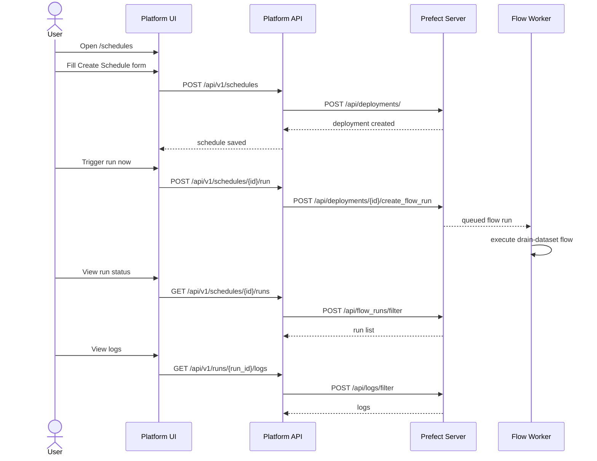

# Cron Scheduling Architecture

This document describes how the platform wraps Prefect to provide cron-based schedule management from the `/schedules` UI and API.

## Service topology

The Docker Compose setup uses one shared database and a separate Prefect control plane:

- `postgres`: shared Postgres instance with two databases (`finetune` and `prefect`). An init script auto-creates the `prefect` database on first boot.
- `minio`: artifact and log-related storage for platform workflows
- `api`: FastAPI platform API that owns `/schedules` and proxies Prefect REST calls
- `prefect-server`: Prefect 3 server on port `4200`
- `flow-worker`: process that runs `prefect.serve()` and executes scheduled flows

```mermaid
flowchart LR
  UI[Platform UI /schedules] --> API[api\nFastAPI platform API]
  API -->|REST proxy| Prefect[prefect-server\nPrefect 3 :4200]
  Prefect -->|metadata DB| Postgres[(postgres\nfinetune + prefect DBs)]
  API -->|app data| Postgres
  API -->|artifacts| MinIO[(minio)]
  Prefect -->|schedule state| Postgres
  Worker[flow-worker\nprefect.serve()] -->|connects to| Prefect
  Worker -->|executes| Flow[drain-dataset flow]
  Flow -->|calls back| API
```

### What this means

- The platform API is the only client the UI talks to for schedule management.
- Prefect owns deployment, cron, run, and log state.
- The worker is separate from the API so scheduled execution stays out of the request path.
- The worker calls back to the platform API via `PLATFORM_API_URL` for data operations.

### Compose service dependencies

```
postgres (healthcheck: pg_isready)
  ├── prefect-server (healthcheck: /api/health)
  │     └── flow-worker (restart: on-failure)
  ├── api
  └── minio (healthcheck: mc ready)
```

All services wait for their dependencies via `condition: service_healthy`. The `prefect` database is auto-created by an init script mounted into Postgres.

## User workflow

The end-to-end flow is:

1. User opens the UI and navigates to `/schedules`.
2. User submits the Create Schedule form.
3. The platform API creates a Prefect deployment with the cron configuration.
4. Prefect persists the deployment and starts scheduling.
5. The user can trigger a run manually or edit the schedule.
6. The worker picks up the run and executes `drain-dataset`.
7. The user checks run status and logs through the platform UI.



### What this means

- Schedule creation maps to a Prefect deployment.
- Manual trigger requests create an immediate flow run.
- Run lists and logs are read back from Prefect, not stored in the platform API.

## API endpoint mapping

| Platform Endpoint | Prefect Endpoint | Notes |
|---|---|---|
| `POST /api/v1/schedules` | `POST /api/deployments/` | Create deployment with cron schedule and `flow_id` |
| `GET /api/v1/schedules` | `POST /api/deployments/filter` | List all deployments (enriched with `flow_name`) |
| `GET /api/v1/schedules/{id}` | `GET /api/deployments/{id}` | Get single deployment |
| `PATCH /api/v1/schedules/{id}` | `PATCH /api/deployments/{id}` | Update deployment (cron via `schedules` array, pause via `paused`) |
| `DELETE /api/v1/schedules/{id}` | `DELETE /api/deployments/{id}` | Delete deployment |
| `POST /api/v1/schedules/{id}/run` | `POST /api/deployments/{id}/create_flow_run` | Trigger ad-hoc run |
| `POST /api/v1/schedules/{id}/pause` | `PATCH /api/deployments/{id}` `{"paused": true}` | Pause schedule |
| `POST /api/v1/schedules/{id}/resume` | `PATCH /api/deployments/{id}` `{"paused": false}` | Resume schedule |
| `GET /api/v1/schedules/{id}/runs` | `POST /api/flow_runs/filter` | List runs for deployment |
| `GET /api/v1/runs/{run_id}` | `GET /api/flow_runs/{run_id}` | Get single run |
| `GET /api/v1/runs/{run_id}/logs` | `POST /api/logs/filter` | Get run logs |

### Prefect 3.x field notes

- Deployments use `flow_id` (UUID), not `flow_name`. The platform resolves names via `POST /api/flows/filter` and auto-registers flows if needed.
- Pause/resume uses the `paused` boolean on deployments.
- Cron schedules live in the `schedules` array: `[{"schedule": {"cron": "...", "timezone": "UTC"}, "active": true}]`.
- PATCH returns 204 (no body); the platform re-fetches after patching.

## Worker deployment model (V1)

The flow-worker uses `prefect.serve()` to register and poll a **well-known deployment** for each flow:

| Flow | Served Deployment Name |
|---|---|
| `drain-dataset` | `drain-dataset-deployment` |

**V1 limitation**: Only runs for the served deployment names are executed by the worker. The UI should create schedules with matching deployment names for automatic execution. Manually triggered runs (`create_flow_run`) work regardless.

**V2 plan**: Migrate to Prefect work pools for fully dynamic execution of any deployment.

## First flow

The first scheduled flow is `drain-dataset`, which exports or drains dataset data on a cron interval.

Typical parameters:

- `dataset_id`
- `target_format` (for example, `jsonl`)
- `destination` (for example, `local`)

The flow calls back to the platform API (`PLATFORM_API_URL`) to fetch export data.

## Dashboard link

The UI header includes a link to the Prefect dashboard at `http://localhost:4200` for deeper inspection.

## Error handling

The platform maps Prefect HTTP errors to standard API responses:

| Prefect Response | Platform Response | Detail |
|---|---|---|
| 404 | 404 | Context-specific: "schedule not found", "flow run not found", etc. |
| 400-499 (not 404) | 422 | Validation error with Prefect's response body |
| 500+ | 502 | Prefect server error |
| Connection error | 503 | Prefect server unavailable |

## Cron validation

- **Backend**: Uses `croniter.is_valid()` Pydantic validator — rejects invalid expressions at the API level with 422.
- **Frontend**: Lightweight check for 5 space-separated fields in the form.
