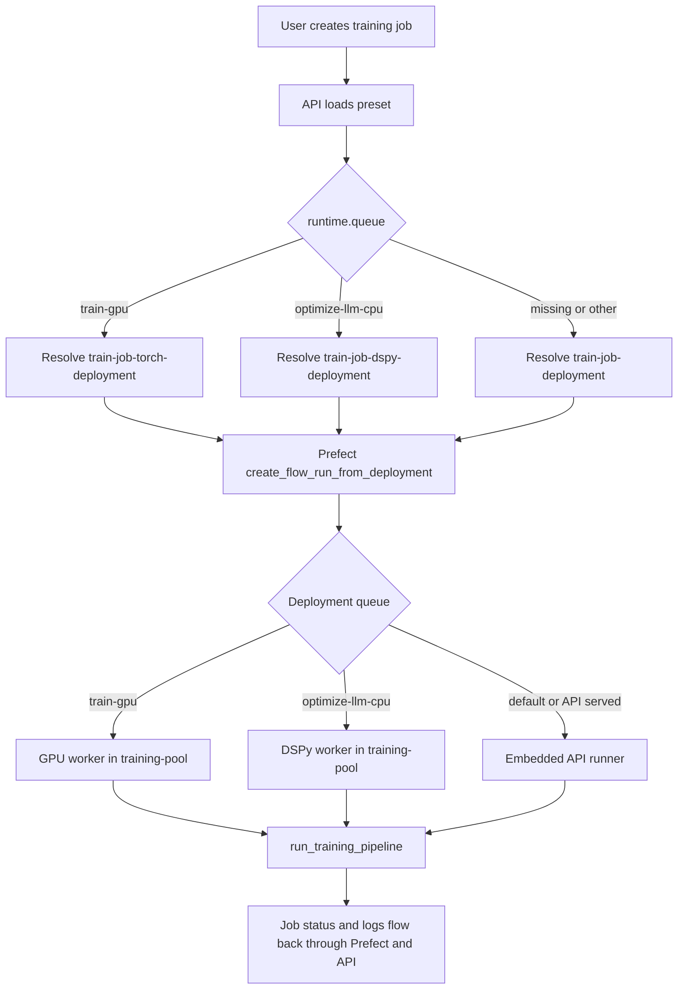

# Prefect Training Delegation

## Purpose

This document defines the target execution model for `execution.engine: prefect` when the platform uses **true delegation**:

- the API process owns only API-local Prefect work
- GPU training is delegated to a dedicated GPU worker
- DSPy optimization is delegated to a dedicated DSPy worker
- queue selection is driven by preset runtime metadata

It records the target architecture and the implemented delegation topology.

## Terms

- `API runner`: the embedded `prefect.runner.Runner` started by `apps/api/app/main.py`
- `GPU worker`: a Prefect V2 process worker consuming queue `train-gpu`
- `DSPy worker`: a Prefect V2 process worker consuming queue `optimize-llm-cpu`
- `default deployment`: `train-job-deployment`
- `GPU deployment`: `train-job-torch-deployment`
- `DSPy deployment`: `train-job-dspy-deployment`

## Delegation Logic

### 1. Preset chooses a runtime queue

The preset controls routing.

Examples:

- `resnet50-cls-v1` sets `runtime.queue: train-gpu`
- `dspy-vqa-v1` sets `runtime.queue: optimize-llm-cpu`
- presets without a specialized queue fall back to the default deployment

### 2. The API maps queue to deployment

`apps/api/app/services/prefect_engine.py` uses the preset queue to choose a deployment name:

- `train-gpu` -> `train-job-torch-deployment`
- `optimize-llm-cpu` -> `train-job-dspy-deployment`
- no queue or unknown queue -> `train-job-deployment`

### 3. Prefect creates a flow run from that deployment

The API does not execute the training directly in this path. It submits a run from the selected deployment through the Prefect API.

### 4. The matching worker consumes the queue

The worker that is listening to the deployment's queue executes the run:

- queue `train-gpu` -> GPU worker
- queue `optimize-llm-cpu` -> DSPy worker
- default work -> API runner

## Flow Chart

## Target Ownership Model

### API process

The API runner should register and execute only:

- `drain-dataset-deployment`
- `train-job-deployment`

The API runner should **not** register or execute:

- `train-job-torch-deployment`
- `train-job-dspy-deployment`

### GPU worker

The GPU worker should:

- run in Prefect V2 worker mode
- attach to work pool `training-pool`
- consume queue `train-gpu`
- register or serve `train-job-torch-deployment`
- ensure the `training-pool` work pool exists before starting worker consumption

### DSPy worker

The DSPy worker should:

- run in Prefect V2 worker mode
- attach to work pool `training-pool`
- consume queue `optimize-llm-cpu`
- register or serve `train-job-dspy-deployment`
- ensure the `training-pool` work pool exists before starting worker consumption

## Implemented Topology

The current implementation is:

- the embedded API runner registers `drain-dataset-deployment` and `train-job-deployment`
- the GPU worker bootstraps `train-job-torch-deployment` and consumes queue `train-gpu`
- the DSPy worker bootstraps `train-job-dspy-deployment` and consumes queue `optimize-llm-cpu`
- delegated workers ensure the configured Prefect work pool exists before registering their owned deployment

This keeps deployment ownership aligned with worker ownership.

## Runtime Topology

### API-owned deployments

- `drain-dataset-deployment`
- `train-job-deployment`

### Delegated workers

Compose and Kubernetes use two delegated workers:

- `training-worker-gpu`
- `training-worker-dspy`

Worker configuration:

- GPU worker: `WORK_POOL_NAME=training-pool`, `WORK_QUEUE_NAME=train-gpu`
- DSPy worker: `WORK_POOL_NAME=training-pool`, `WORK_QUEUE_NAME=optimize-llm-cpu`

Bootstrap behavior:

- delegated workers ensure the work pool exists before worker startup
- GPU worker registers `train-job-torch-deployment`
- DSPy worker registers `train-job-dspy-deployment`
- API remains the owner of `drain-dataset-deployment` and `train-job-deployment`

## Verification Checklist

1. start the stack
2. verify all four deployments exist in Prefect when schedule and training paths are initialized as expected
3. verify the API runner does not serve the specialized deployments
4. verify the GPU worker is attached to queue `train-gpu`
5. verify the DSPy worker is attached to queue `optimize-llm-cpu`
6. submit a `resnet50-cls-v1` job and confirm it runs on the GPU worker
7. submit a `dspy-vqa-v1` job and confirm it runs on the DSPy worker
8. submit a default training job and confirm it runs on the API runner

## Operational Rules

- One worker process should own one specialized queue unless the worker bootstrap is deliberately expanded to manage multiple queues.
- The API runner should remain responsible only for API-local and default execution paths.
- Queue names in presets, deployment definitions, worker env, and docs must match exactly.
- When adding a new specialized runtime queue, update both the queue-to-deployment mapping and the worker topology together.

## Suggested Naming

Use explicit service names so ownership is obvious during operations:

- `training-worker-gpu`
- `training-worker-dspy`

Avoid generic names like `training-worker` once multiple delegated workers exist.
